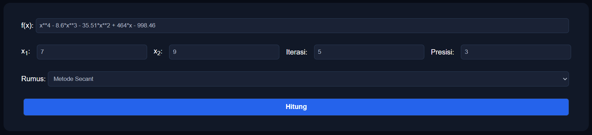
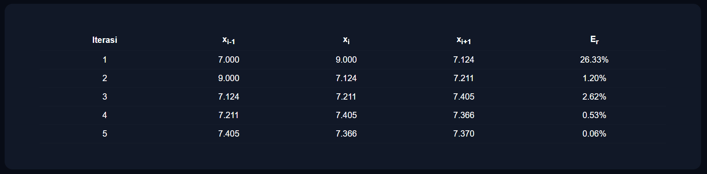
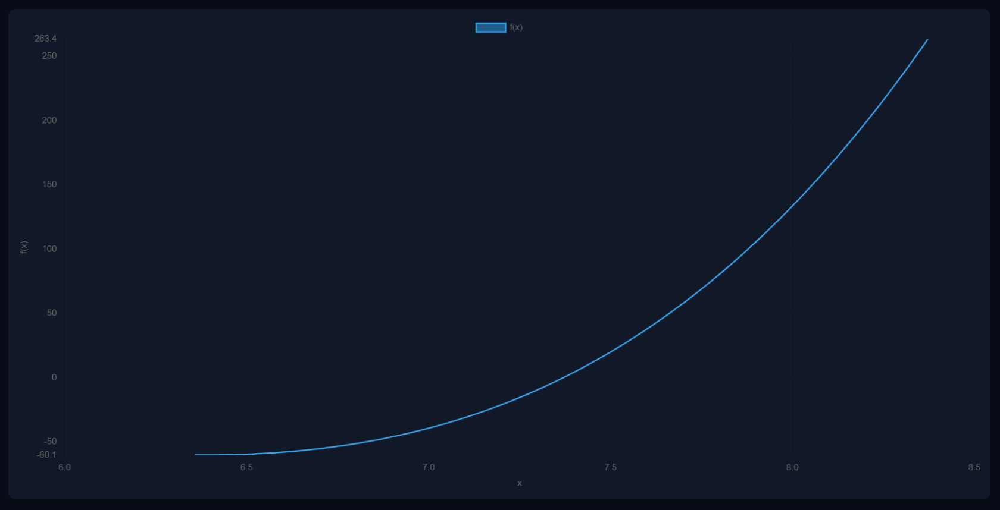

# Praktikum-Komnum
- Praktikum PPT 2 & PPT 3  

## Penjelasan Singkat

Code ini merupakan sebuah website yang dibuat oleh tiga orang. Website ini dibuat untuk membantu kegiatan praktikum komputasi numerik, khususnya menunjukkan tabel iterasi dan grafik.

Metode yang diimplementasikan dalam website ini adalah:
- Metode Regula Falsi
- Metode Secant

##  Format Input Fungsi

Agar fungsi dapat diproses dengan benar oleh sistem, penulisan fungsi harus mengikuti aturan berikut:

- Gunakan `.` sebagai koma desimal
- Gunakan `x` sebagai variabel  
- Gunakan `*` untuk operasi perkalian  
- Gunakan `**` untuk operasi pangkat  
- Gunakan operator dasar seperti `+`, `-`  

##  Format Output

- Menampilkan Iterasi secara bertahap dalam bentuk tabel
- Menampilkan x1, x2, x3, f(x1), f(x2), f(x3), dan Eror relatif untuk Regulasi Falsi
- Menampilkan xi-1, xi, xi+1, dan Eror relatif untuk Metode Secant
- Grafik f(x)

## Contoh Input

## Contoh Output

## Grafik

